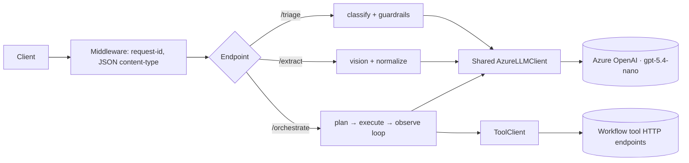

# Architecture

## System overview

One FastAPI service exposes all three task endpoints plus `/health`. Every task
shares the same spine: a single Azure OpenAI client, built once at startup and
reused for every request. Each task adds a thin package (`triage/`, `extract/`,
`orchestrate/`) with the same three parts — a `prompt.yaml` you can read, a
`prompt.py` that assembles messages, and a domain module that turns model output
into a valid response.

The design has one governing idea: **trust the model for judgment, enforce the
contract in code.** The model classifies, extracts, and plans. Deterministic
code guarantees the shape of what we return — valid enums, coerced numbers,
capped loops, derived counts. Model output is never handed back raw.

## Endpoints

| Endpoint | Method | Description |
|---|---|---|
| `/health` | GET | Health check. Returns 200 if the service is alive |
| `/triage` | POST | Task 1: Classify a spacecraft signal across 5 dimensions |
| `/extract` | POST | Task 2: Extract structured data from a document image |
| `/orchestrate` | POST | Task 3: Plan and execute a multi-step workflow |

Every response carries observability headers: `X-Model-Name` (drives cost
scoring), `X-Prompt-Tokens`, `X-Completion-Tokens`, and `X-Request-ID`. On an
internal failure each task also sets an error header (`X-Triage-Error`,
`X-Extract-Error`, `X-Orchestrate-Error`).

## Task 1 (Signal Triage): AI pipeline

One LLM call per signal. The model runs in JSON-object mode and its reply is
validated against the fixed `TriageDecision` schema (the server injects
`ticket_id` afterward), so it can only emit valid enum labels — with lenient
before-validators that coerce near-misses instead of rejecting them. The system
prompt in `triage/prompt.yaml` is organized by scored dimension — category, team,
priority, escalation, missing-information — each with its own rubric and
tie-breaks. It is **zero-shot**: earlier few-shot examples were removed because
they made the small model rigid on adversarial inputs. To replace what they taught
implicitly, the prompt states the output format explicitly (emit the bare
`priority` code, copy enum strings verbatim), and the `TriageDecision`
before-validators coerce a labelled reply such as `"P2 (Yellow Alert)"` back to
`"P2"` — so a cosmetic model quirk can never turn a scored item into a 503.

After the call, `triage/guardrails.py` enforces the invariants the model cannot
be trusted to always get right:

- Force `assigned_team = None` when the category is "Not a Mission Signal"; back-fill a default team when the model drops one for a real category.
- A narrow, hand-picked phrase list (`hull breach`, `decompress`, `life support failure`, `restricted zone`, …) forces `needs_escalation = true` regardless of what the model said.
- De-dupe `missing_information`, re-stamp `ticket_id` from the request, and truncate oversized descriptions before they reach the prompt.

**Prompt-injection defense** lives in two places: the prompt tells the model the
subject and description are untrusted data to classify, not instructions to obey;
the guardrails then override the fields that matter for safety.

## Task 2 (Document Extraction): AI pipeline

One vision call per document. The image is decoded from base64, its MIME type is
sniffed from magic bytes (PNG/JPEG/GIF/WEBP only), size-capped at 8 MB, and passed
as a data URI. Vision is slower than text, so this endpoint gets a longer 18s
timeout and a 4096-token budget.

The per-document `json_schema` arrives as a string and is used twice. The raw
string goes straight into the prompt so the model sees the exact field names,
types, and descriptions. A parsed copy drives `extract/normalize.py` afterward:

- **Numbers and integers** are coerced — `"$1,234.56"` becomes `1234.56`.
- **Booleans** are coerced from `yes/no/1/0/true/false`.
- **Strings are left exactly as extracted.** This is deliberate: scoring rewards on-document formatting, so stripping a `$` or comma would lose points.
- Keys the schema does not define are pruned; tables are extracted row by row.

No fixed Pydantic model is used here because the schema is different on every
request. Extraction returns a plain dict with the schema's keys, plus the
`document_id` stamped from the request.

## Task 3 (Workflow Orchestration): AI pipeline

A bounded **plan → execute → observe** loop that resolves to **one planning call
for the common case**. When every parameter is already known from the goal, the
planner emits the whole workflow in a single batch and sets `workflow_complete`;
the loop takes another round only for genuine discovery tails (search → check →
act), and is capped at 3 planning rounds and 30 tool calls. Collapsing the typical
workflow from four LLM round-trips to one is the main latency and throttling win
(see the rate limiter below). Each round, the planner sees the goal, the available
tools, the constraints, and every observation so far, then emits the next batch of
tool calls plus a `workflow_complete` flag.

Execution is a hybrid. Consecutive calls to the *same* tool run concurrently via
`asyncio.gather`; group boundaries preserve ordering between different tools, so
queries still finish before the notifications that depend on them.

**Failures do not crash the workflow.** An unknown tool name or malformed
parameters becomes a failed step, not an exception. The tool client retries once
on 429/5xx and timeouts, honoring `Retry-After`. Every result — success or error —
becomes an observation the planner can react to. A repeated identical batch trips
cycle detection and stops the loop. Tool URLs come only from the request's tool
definitions, never from model output (SSRF defense). Final `status` and the
aggregate counts are derived from the recorded step trace, not from the model.

## Cross-Task Design Decisions

**Shared, not duplicated.** All three tasks use one `AzureLLMClient` over one
Azure deployment (`gpt-5.4-nano`), one httpx connection pool, and one settings object.
Tasks differ only in prompt, token budget, and timeout.
The three model settings are separate so any task *could* be pointed
at a different deployment, but today they all resolve to the same one.

**JSON-object mode, manual validation — not tool/function calling.** The client
always requests `{"type": "json_object"}`, parses the string, and validates
against a Pydantic model where one exists. This handles arbitrary per-request
schemas (extraction) and keeps one code path for all three tasks. The cost: no
API-level schema enforcement, so validation is our job.

**Resilience is shared too.** All three endpoints share one Azure deployment and
therefore one rate quota, so a **global token-bucket rate limiter** in the
`AzureLLMClient` paces every request *start* — refilling at a fraction of the quota
(800 of 1,000 RPM) and holding a small burst budget. The retry path is gated by the
same bucket, so retries can't amplify a storm — the failure that sank the portal
run (see *Local score vs. portal score* below). On top of it: a per-attempt timeout
(10s default, 18s for vision), up to three retries with jittered exponential
backoff honoring `Retry-After`, and a bounded httpx pool sized to the concurrency
limit. Once the retry budget is exhausted the request surfaces as a 503. Malformed
HTTP or JSON is rejected at the edge — 400 for bad JSON, 422 for schema errors, 415
for the wrong content type. With the quota raised to 1,000 RPM and the limiter
sized so a burst still clears within the probe window, a local run passes all seven
resilience probes.

**One inconsistency, stated plainly.** Extract and orchestrate return a scored
200 fallback on internal failure (a `{document_id}` envelope; a `failed`
workflow envelope). Triage instead returns **503**. Failing loud on triage avoids
confidently mis-routing a safety-critical signal, but a non-200 forfeits that
item's score. It is a defensible safety choice and a real cost — see tradeoffs.

## Infrastructure

Deployed to Azure with Pulumi (Python), fully passwordless — no keys or connection
strings stored anywhere. One resource group holds:

- **Azure Container Apps** running the container on external ingress (port 8000) with a `/health` probe, 1 CPU / 2 GiB, scaling 1–3 replicas.
- **Azure Container Registry** (admin disabled), pulled via a user-assigned managed identity with `AcrPull`.
- **Azure AI Foundry** (`AIServices`) with local auth disabled and a model deployment; the same identity holds `Cognitive Services OpenAI User`. The app authenticates with `DefaultAzureCredential`. The deployment quota was raised to 1,000 RPM to give the shared rate limiter headroom at hidden-set scale.
- **Log Analytics** for container stdout/stderr.

The image builds from the `py/` workspace root so the shared common libs are in
context. Container Apps re-pulls on the next revision, so the app goes healthy
shortly after the first `az acr build` without a second `pulumi up`.

## Key tradeoffs

**Model size vs. everything.** We run one nano-tier model across all three tasks.
The eval run settled the bet ([evals.md](evals.md), composite **65.6**): the cost
half paid off — nano maxes the cost sub-score (**1.000** on every task) — but the
"nano is also fast" half did not. Latency, not cost, is the systemic drag.
Efficiency averages **50.4**, every task's latency score is **≤ 0.262**, and
orchestration's P95 (**11.9 s**) fully saturates the penalty (score **0.000**).
Resolution held up better than feared (avg **64.9**), so the honest lesson is the
reverse of what we planned for: a cheap model bought the cost points and cost us
the latency points.

**What worked**

- *Judgment in the prompt, contracts in code.* Guardrails, normalization, and loop caps catch model mistakes and are unit-testable without a network call.
- *One shared client.* Reusing the connection pool keeps cold starts fast and quota usage predictable.
- *Targeted few-shots* on triage's hard cases, and *string-fidelity preservation* on extraction, both map directly to how the tasks are scored.
- *Same-tool parallelization* in orchestration cuts latency on fan-out workflows.

**What didn't (or isn't done yet)**

- *Latency, and a few resolution gaps, now measured.* Efficiency is the weakest axis (avg 50.4) — see the tradeoff above. On resolution, triage's `missing_info` (0.249), orchestration's `goal_completion` (0.452), and extraction's `text_fidelity` (0.600) leave the most points on the table; [evals.md](evals.md) has the per-dimension breakdown.
- *The 503-vs-200 split above.* Consistent behavior would either fall back everywhere or fail loud everywhere; today it is split.
- *Orchestration's `accounts_processed` is still a heuristic.* `constraints_satisfied`, `emails_skipped`, and `skip_reasons` are now populated from the planner's final self-report (with `constraints_satisfied` filtered to verbatim request constraints), but `accounts_processed` remains a fragile scrape of `account_id` parameters from the step trace.
- *Domain rules as prose.* Orchestration's roles, templates, and channels live in the prompt, not in validated code, so they can drift and risk overfitting the public set.
- *Schema coverage.* Extraction now normalizes nested objects and arrays-of-objects (a property the model omits is emitted as `null` instead of vanishing), but an unparseable schema still degrades to passthrough mode, and there is no `enum` or `pattern` enforcement.
- *Static team back-fill* in triage cannot express the documented gray areas (a security-dominant biometric issue, onboarding → Systems Engineering); that nuance lives only in the prompt.

**What we'd change for production.** The global rate limiter and the one-call
orchestration path close the throttling gap that sank the portal run; the next
frontier is latency — it still caps efficiency on every task: trim round-trips and
prompt size, and revisit the nano-only choice where P95 is worst (vision extraction
most of all). Then make the failure contract consistent, harden
`accounts_processed` into a real entity count, move the orchestration playbook into
validated code, and widen schema coverage.
